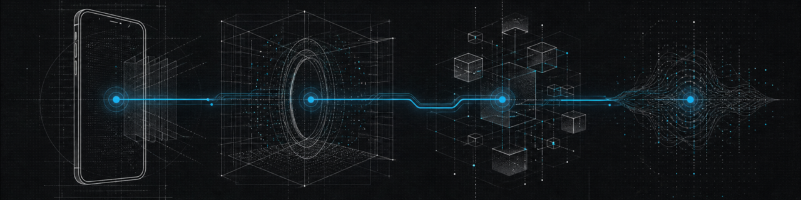
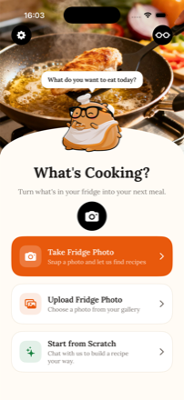
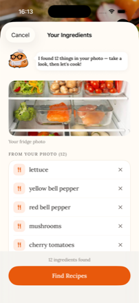
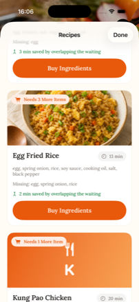
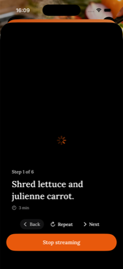
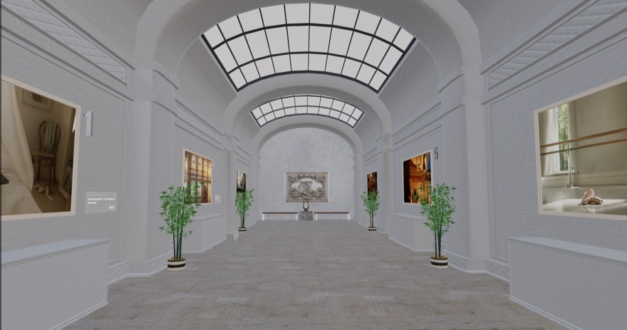
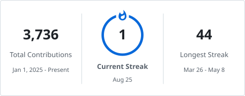

  

<h1 align="center">Tommy Huang</h1>

  <strong>Software engineering student in Sydney</strong> 
  iOS · Full-stack · Applied AI 
  Master of IT at UTS · Graduating July 2027 
  Open to software engineering internship and graduate roles

  <a href="https://minchiahuang.github.io/">Portfolio</a> ·
  <a href="https://www.linkedin.com/in/min-chia-huang-698a6b184/">LinkedIn</a> ·
  <a href="https://minchiahuang.github.io/TommyHuang_Resume.pdf">Résumé</a> ·
  <a href="mailto:minchia.huang.dev@gmail.com">Email</a>

## About

I came to software after studying screen production. Film taught me to ask what an audience needs and cut anything that does not earn its place, and I now bring that habit to the software I build. I am completing a Master of IT at UTS and looking for an internship or graduate role in Sydney.

## Selected work

### [CookPilot](https://minchiahuang.github.io/cookpilot.html)

`Swift` `SwiftUI` `Meta Wearables DAT` `On-device speech` `OpenAI`

A hands-free iOS cooking assistant for Ray-Ban Meta glasses. Our team won first place at the ICON x Lyra Hackathon in July 2026. I built the iOS app front to back, including the SwiftUI screens, cooking state machine, timers, recipe and diet-profile logic, and model service layer.

  
  
  
  

[Read the case study](https://minchiahuang.github.io/cookpilot.html)

### [Visual Eyes](https://minchiahuang.github.io/visual-eyes.html)

`Swift` `SwiftUI` `RealityKit` `visionOS` `OpenAI Responses API`

An in-development Apple Vision Pro prototype that turns a person's answers about their future into a narrated, walkable museum. I built the SwiftUI flow, typed generation pipeline, RealityKit world builder and voice loop for a four-person Apple Foundation Program team.

  

[Read the case study](https://minchiahuang.github.io/visual-eyes.html) · [View the code](https://github.com/minchiaHuang/Vision-Pro)

### [LearnGuard](https://github.com/minchiaHuang/LearnGuard)

`Python` `SwiftUI` `MCP` `FastAPI` `pytest`

An MCP action gate built for the OpenAI Codex Hackathon Sydney. LearnGuard checks a learner's demonstrated understanding before allowing stronger workspace actions, while a SwiftUI scoreboard makes the gate, leakage checks and red-team cases visible.

[View the repository](https://github.com/minchiaHuang/LearnGuard)

### [VaxAgent](https://github.com/minchiaHuang/VaxAgent)

`Python` `FastAPI` `WebSocket` `Explainable AI`

An explainable research workflow prototype for veterinary oncology. It ranks neoantigen candidates, generates plain-English explanations and keeps a human in the decision loop. It is a research-use prototype, not a clinical product or medical device.

[View the repository](https://github.com/minchiaHuang/VaxAgent)

## Tech stack

`Swift` · `SwiftUI` · `RealityKit` · `TypeScript` · `Python` · `FastAPI` · `Git` · `GitHub Actions`

## GitHub activity

  <picture>
    <source media="(prefers-color-scheme: dark)" srcset="./assets/generated/github-stats-dark.svg" />
    <source media="(prefers-color-scheme: light)" srcset="./assets/generated/github-stats-light.svg" />
    
  </picture>

  <picture>
    <source media="(prefers-color-scheme: dark)" srcset="./assets/generated/github-streak-dark.svg" />
    <source media="(prefers-color-scheme: light)" srcset="./assets/generated/github-streak-light.svg" />
    
  </picture>

## Contact

For software engineering internship or graduate opportunities in Sydney, email [minchia.huang.dev@gmail.com](mailto:minchia.huang.dev@gmail.com) or connect with me on [LinkedIn](https://www.linkedin.com/in/min-chia-huang-698a6b184/).
